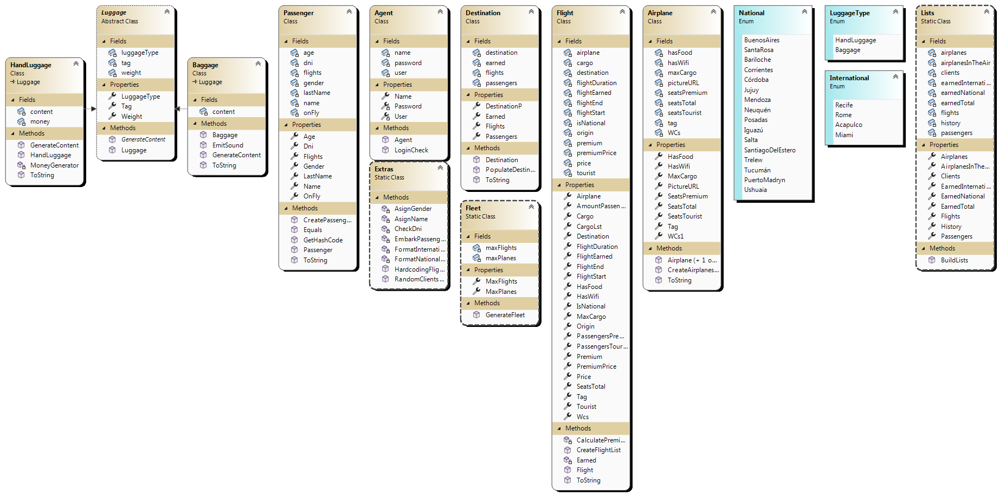

# *2do D - Primer Parcial*

# Delmar.Jeronimo.PrimerParcial
1st Exam - 2022

## **Title:** *"1st Exam, 2ºD, 2022 - Magical Turkish Airlines"* ✈️
    
    

---
    
**About me:**

*My name is Jerónimo Delmar and (as you may probably know) I'm a 1st year Programming student at UTN-FRA.
Prior to this I never had any contact with programming, although I have a wide and general experience with mechanic and electronic devices.
This project posed a real challenge, as I can generally visualize mechanic blocks, but I had 0 knowledge about MVSC, Windows Forms, and interface controls
and how to deal with them. I resulted into a thrilling, intense, exhaustive, and fun experience.*

---
---

## **CLASS DIAGRAM**
    
    

---

## Subject 1: *"Introduction to .NET & C#"*
    
- Time and dates: the premise asks from us to show the current Date in the taskbar using the short format, so it's obviously shown there.
Beyond that, every flight has a departure date and an arrival date, calculated from a random year, day, month, hour, minute, and second, a random duration
in minutes, and from there summing the duration to the departure date you get the arrival date.
This is applied both in the creation of flights by the user, and the automatic hardcoding at the start of the program.
    
- StringBuilder: it's used together with the override to the ToString() method in order to turn objects into their mere string data and return it.
Using the (controversial) technique of appending a special character with each block of data and then splitting the whole string using that character
as parameter, I was able to transform the text returned back to its bits.
    
## Subject 2: *"Static classes and methods"*
    
- Namespaces: the project is obviously separated in 2 namespaces: 'Library', that represents the classes and methods library, and 'UI', that represents
all the forms that implement the Library.
    
- Static Classes and Methods: inside the Library there are 2 static classes. One corresponds to Flights, and the other to Extra (that contains a bunch of extra elements that don't fit anywhere else). The reasons is these classes don't represent objects, so they are not meant to be instanced and they are ran
at the very start of the program, to do only one task. - Extras can be and will be used later in the program, but it doesn't represent an object of
any kind.

## Subject 3: *"Object Oriented Programming"*

- Abstraction: this is present in the designing, development, and declaration of every single class present in the program, thinking on each element present
in the scenary given by the premise and trying to take their most fundamental aspects that led later to the formulating of the particular class's attributes,
properties, and methods.
This goes together with 'Classes', 'Objects', and of course the object's builders.

## Subject 4: *"Overload"*

- Builders Overload: this is the only type of overload present at this project (not counting with the ones present at the projects abstract class, which is an override and not an overload). It's present at the building of planes, since every plane has a specified picture url.
If a plane has no parameter for a picture, then the program uses a 2nd builder (that's: the overload) that asks for no param for the url and sets a default
picture.

## Subject 5: *"Windows Forms"*

There's little to say about this subject. The whole program is built based on Windows Forms and particularly the interface controls the forms provide to
control the flow of the program, input the data, validate it, and send blocks of data between an instance and another.
The program could theoretically be ported to a console application with some fixes.

## Subject 6: *"Collections"*

The program uses 2 types of generic collections: dictionaries, and lists.

- Lists: are everywhere, since most of the program is based on lists.

* Clients: they are managed with lists given there's no need to keep the clients sorted, lists expand and shrink dynamically, and the elements inside can
  be counted and located by index. They are provide all the elements needed for managing a group of clients when the only real difference among them is their
  ID (here the DNI), and this is either generated automatically when the client is generated by a random method, or entried by the user.
  If some DNI exists already, the user gets a warning in a manual input. - The random method, on the other hand, discards the client automatically and
  generates a new one.

* Airplanes: similar reasons apply for the airplanes. The only need is to store them, find them by index, or iterate them in an expandable list or group.

* History, flights, airplines in the air, new clients (a temporary list that only appears in a single instance), available clients (those clients that are
not currently flying), luggage. Everything follows the same logic.

- Dictionaries: these are used inside the flights to give each passenger a key, which works as a seat. Although at the current moment there's no need for
this to happen, a possible change in the future when kicking a passenger from a plane (while still on the ground) could arise as a need, knowing in which
seat that passenger was and marking it as free would be necessary.

## Subject 7: *"Encapsulation"*

As taught, every property of every class is private, their values only accessible through their Properties, and in some cases as the Agents the Properties
are even private and can only be checked by a public method, which returns no data but a boolean value that indicates if the entried data matches or not
with the values inside of a given object.

Inside of this subject there are also 'enums'. The program counts with 2 of them; one for National destinations, and the other for International ones.
These are used anytime a flight is created; their value is later stored as a string inside of the 'flight-object'.
Since this is used at different parts of the program, the enums are accessed at several points.

## Subject 8 and 9: *"Inheritance and Polymorphism"*

This 2 subjects go together hand by hand in this program.

The class chosen and used for Inheritance and Polymorphism is Luggage. This one derives into 2 other classes: 'hand luggage', and 'baggage'. Both of them
have the same attributes and inherit the abstract method "GenerateContent", which works differently for each of this two derived classes.

The reason behind picking this particular class for applying this subject is the similitude of the concepts that both refer to 'luggage', and the fact that the two objects can be thrown in a same list of the type 'luggage' given they both derive from the same class. At the same time they can both be used as their parent, which is a non-instanceable class but an abstract concept on itself.

//-----------------------

### Positive aspects of the program:

- It's open to change.
- It can be flexible.
- It's simple.

### Negative aspects of the program:

- I had not and still haven't a solid concept of how selling a plane ticket should work. Due to this the program doesn't aim to plan flights, but instead
works in the present moment, very much like an air-taxi agency.

---

**Note:** I still think passengers should have Health Points and faint (at least) during the trip. Traveling is tiring.
